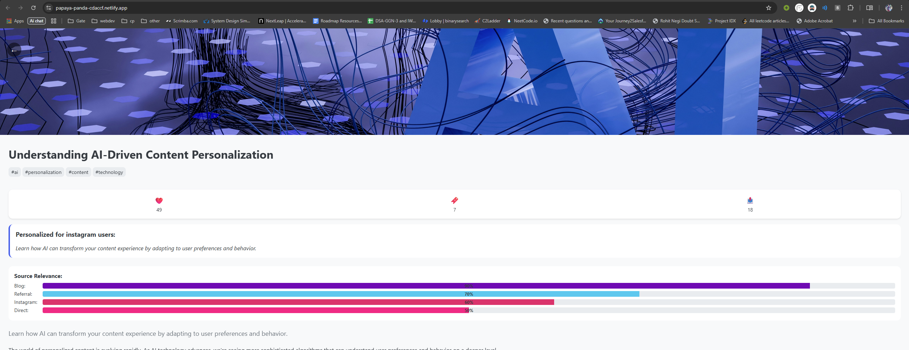
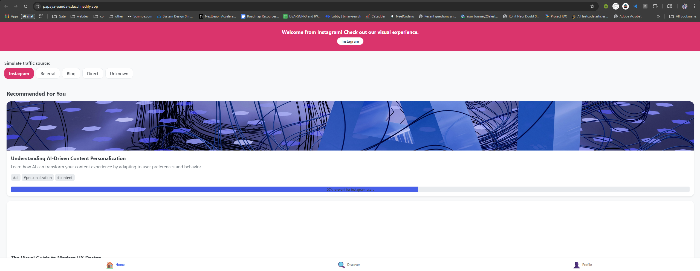

# SmartOnboardAI

## 🚀 Live Demo

👉 [View the deployed app on Netlify](https://papaya-panda-cdaccf.netlify.app/)

---

## 🏆 Hackathon Submission

This project was built for [Build Fest '25 Hackathon](https://vision.hack2skill.com/event/buildfest?utm_source=hack2skill&utm_medium=homepage&sectionid=6809df329543bede75139890) using React Native, Expo, and Gemini AI.

---

## 📸 Screenshots

### Home & Source Simulation


### Content Detail & Personalization


---

SmartOnboardAI is a cross-platform, source-adaptive onboarding app built with React Native, Expo, and Gemini AI. It personalizes the onboarding experience based on how users arrive at your app (e.g., Instagram, referral, blog, or direct) and provides analytics and content tailored to each source.

## Features

- **Source Detection**: Detects how users arrived (Instagram, referral, blog, direct, etc.)
- **Personalized Onboarding**: Customizes onboarding slides and content for each user source
- **Gemini AI Integration**: Uses Gemini AI for content analysis and recommendations
- **Analytics Dashboard**: Tracks user engagement and source analytics
- **Deep Linking**: Supports UTM parameters and deep links for accurate source tracking
- **Responsive UI**: Works seamlessly on web, iOS, and Android
- **Modern React Native/Expo Stack**: Fast development, easy deployment

## Installation

```bash
# Clone the repository
https://github.com/skup-sci/SmartOnboardAi.git
cd SmartOnboardAi

# Install dependencies
npm install

# Set up environment variables
cp .env.example .env
# Edit .env and add your Gemini API key

# Start the development server
npm start

# Run on web
npm run web

# Run on iOS (requires Mac)
npm run ios

# Run on Android
npm run android
```

## Usage

- Open the app on your device or browser.
- The onboarding flow will adapt based on your detected source (Instagram, referral, blog, direct, etc.).
- Explore personalized content and analytics.
- Try different UTM parameters or deep links to simulate various sources.

## Environment Variables

Create a `.env` file in the root directory:

```
GEMINI_API_KEY=your_gemini_api_key_here
```

## Project Structure

```
SmartOnboardAi/
  src/
    assets/         # Images, icons, etc.
    components/     # Reusable UI components
    constants/      # App constants and theme
    contexts/       # React contexts for global state
    hooks/          # Custom React hooks
    navigation/     # Navigation configuration
    screens/        # App screens
    services/       # API, analytics, and business logic
    types/          # TypeScript type definitions
    utils/          # Utility functions (responsive, source detection, etc.)
  App.tsx           # App entry point
  README.md         # Project documentation
  ...
```

## Contributing

1. Fork the repository
2. Create your feature branch (`git checkout -b feature/YourFeature`)
3. Commit your changes (`git commit -am 'Add new feature'`)
4. Push to the branch (`git push origin feature/YourFeature`)
5. Open a pull request

## License

MIT
